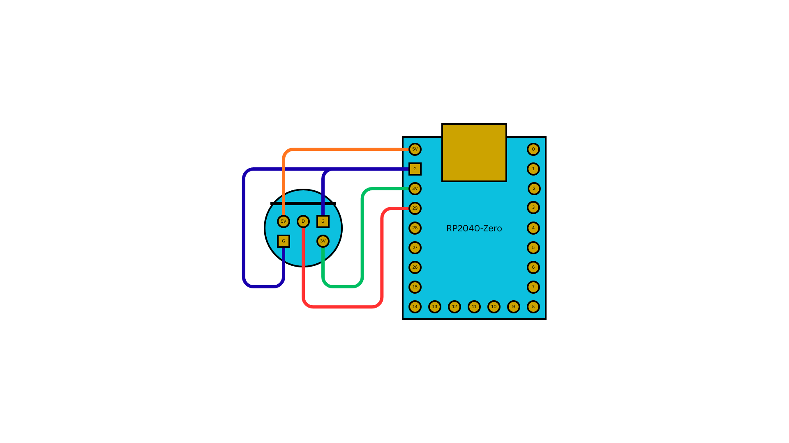

# gc2usb

GameCube controller to USB HID gamepad.

## Overview

Reads a native GameCube controller via the joybus single-wire protocol and outputs as a USB HID gamepad. Full support for both analog sticks, analog triggers (L/R), and rumble motor. Three button mapping profiles.

## Input

[GameCube Input](../input/gamecube.md) -- Joybus PIO protocol on a single GPIO (pin varies by board, see Supported Boards), polled at 125Hz (native GC rate).

## Output

[USB Device Output](../output/usb-device.md) -- USB HID gamepad with multiple emulation modes.

## Core Configuration

| Setting | Value |
|---------|-------|
| Routing mode | SIMPLE (1:1) |
| Player slots | 1 (fixed) |
| Data pin | GPIO 29 (KB2040) / GPIO 2 (RP2040-Zero) / GPIO 28 (Pico) |
| Profile system | 3 profiles |

## Profiles

| Profile | Description |
|---------|-------------|
| **Default** | Standard mapping: A=B1, B=B2, X=B3, Y=B4, Z=R2. Triggers map to L2/R2 analog. |
| **Xbox Layout** | A/B swapped |
| **Nintendo Layout** | X/Y swapped |

### Default Profile Button Mapping

| GC Button | USB Output |
|-----------|------------|
| A | B1 |
| B | B2 |
| X | B3 |
| Y | B4 |
| L | L1 |
| R | R1 |
| Z | R2 |
| Start | S2 |
| D-Pad | D-Pad |
| Main Stick | Left Analog |
| C-Stick | Right Analog |
| L Trigger | L2 (analog) |
| R Trigger | R2 (analog) |

## Wiring



## Key Features

- **Full analog** -- Main stick, C-stick, and L/R analog triggers all mapped.
- **Rumble** -- GC rumble motor driven by USB host feedback.
- **USB output modes** -- SInput, XInput, PS3, PS4, Switch, Keyboard/Mouse.
- **Web config** -- [config.joypad.ai](https://config.joypad.ai).

## Supported Boards

| Board | Data Pin | Build Command |
|-------|----------|---------------|
| KB2040 | GP29 | `make gc2usb_kb2040` |
| RP2040-Zero | GP2 | `make gc2usb_rp2040zero` |
| Raspberry Pi Pico | GP28 | `make gc2usb_pico` |

## Build and Flash

```bash
make gc2usb_kb2040       # or gc2usb_rp2040zero / gc2usb_pico
make flash-gc2usb_kb2040
```
